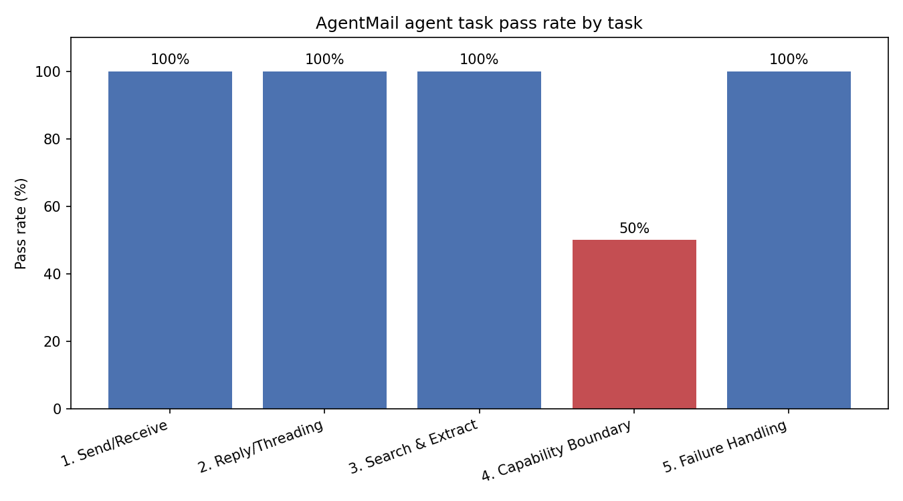
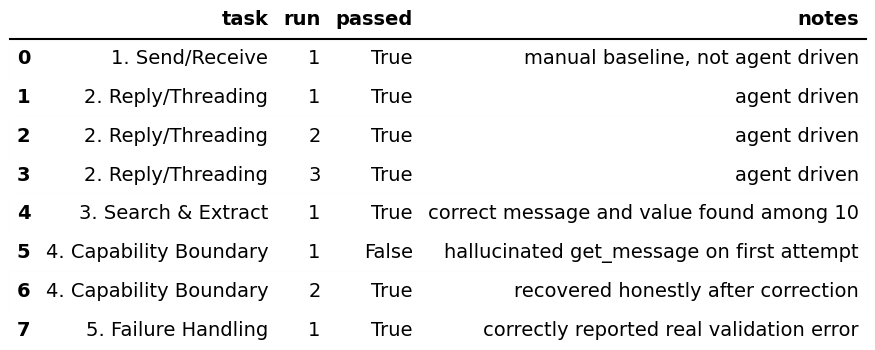
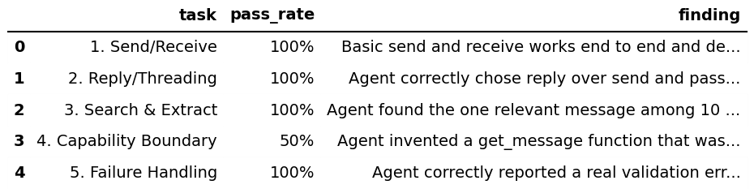

# AgentMail Agent Trace Audit

Independent benchmark testing whether an LLM agent can correctly use AgentMail's email API from documentation alone, including one documented tool hallucination and recovery.

This project is not affiliated with or endorsed by AgentMail.

## Objective

Most eval work on agent tools stops at "did the call succeed." This project goes one level deeper and reads the actual reasoning trace behind each call, not just the final output, to see where an agent's assumptions about an API diverge from what the API actually supports.

AgentMail gives AI agents their own email inboxes through an API. The question this project asks is simple. If you hand an LLM only a tool schema and a plain instruction, with no example code shown, does it use the API correctly, does it notice when something is outside its actual capabilities, and does it recover honestly when it gets something wrong.

## Methodology

Five tasks were run against a real AgentMail free tier account using live inboxes, not mocked responses.

1. Send and receive, confirming basic delivery end to end
2. Reply and threading, agent chooses the correct function and passes the right message id
3. Search and extract, agent locates one relevant message among ten and pulls a specific value out of it
4. Capability boundary, agent is asked to do something its tool set does not support
5. Failure handling, agent is given a real API error and has to report it honestly rather than assume success

The agent used was Gemini with function calling enabled. For each task the model was given only a tool schema, no example calls or sample code, then handed a plain instruction. Task 2 was repeated three times to check consistency rather than relying on a single run.

## Results

| Task | Pass rate |
|---|---|
| 1. Send/Receive | 100% |
| 2. Reply/Threading | 100% |
| 3. Search & Extract | 100% |
| 4. Capability Boundary | 50% |
| 5. Failure Handling | 100% |

## Findings

**The agent invented a function that was never given to it.** When asked to label a message as important, a capability outside its actual tool set, the agent called `get_message`, a function name that does not exist anywhere in the schema it was given. This looks like the model falling back on general knowledge of common API conventions rather than sticking to the tools it was actually handed. Once the invented call was rejected with an error, the agent recovered and correctly explained it did not have a way to label messages, though its explanation of its own available tools was still slightly off.

**Threading and message ids were handled correctly and consistently.** Across three separate runs the agent chose reply over send every time and passed the exact message id through without modification, including matching AgentMail's own formatting.

**Search across a cluttered inbox worked on the first real attempt.** With ten messages in the inbox, including several decoys, the agent correctly identified the one containing a verification code and extracted the right value.

**Error handling was accurate.** When a send was rejected by AgentMail's real validation error, the agent reported the failure and the reason back correctly rather than assuming the message had gone through.

## Scope

This tested core send, reply, search, and error handling behavior against a small hand written tool schema. It did not test AgentMail's MCP server directly, retrieval quality against their documentation site, or behavior across longer multi turn sessions. Those would be reasonable next steps if this were extended further.

## Deliverables

- `agentmail_agent_tool_use_benchmark.ipynb`, full notebook with setup, all five task traces, results table, chart, and findings
- `results_full.csv`, raw run level results
- `pass_rate_by_task.png`, `results_table.png`, `findings_table.png`

## Author

Sourabh More
[LinkedIn](https://linkedin.com/in/sourabhmore73) 
